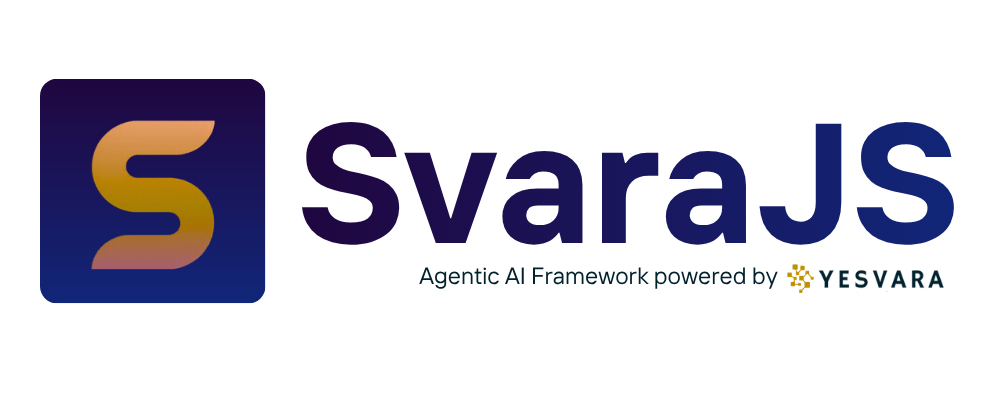

<div align="center">


<!-- # @yesvara/svara -->

**Build AI agents in less than 9 lines - or run one as a full standalone assistant.**

A batteries-included Node.js framework for building agentic AI backends.
Multi-channel, RAG-ready, with terminal/filesystem/browser tools, self-authoring
skills, persistent memory, sub-agent delegation, cron, and a built-in dashboard,
for developers who value simplicity.

[](https://www.npmjs.com/package/@yesvara/svara)
[](./LICENSE)
[](https://nodejs.org)
[](https://typescriptlang.org)

</div>

---

## Why SvaraJS?

Most AI frameworks make you think about infrastructure. SvaraJS makes you think about your agent.

```ts
import { SvaraApp, SvaraAgent, createTool } from '@yesvara/svara';

const agent = new SvaraAgent({
  name: 'Support Bot',
  model: 'gpt-4o-mini',       // provider auto-detected
  knowledge: './docs',         // PDF, MD, TXT, just point to a folder
  tools: [tool_1, tool_2, tool_3], // Agent choose the right tool for answer
});

const app = new SvaraApp().route('/chat', agent.handler()).listen(3000);
// Done. Your agent handles 1000 conversations.
```

That's it. No pipeline setup. No embedding boilerplate. No webhook configuration.
**Convention over configuration (like Express, but for AI).**

---

## Two ways to run SvaraJS

**Library mode** (above) - embed `SvaraAgent`/`SvaraApp` in your own Node.js
backend. You own the process, the routes, the deployment. This is unchanged
from earlier versions and is still the default `svara new` scaffold.

**Standalone mode** - `svara start` boots SvaraJS itself as a full personal
assistant: the agent, whichever built-in tools you enable (terminal,
filesystem, web, browser), skills, persistent memory, cron jobs, every
configured messaging channel, and a web dashboard to manage all of it - all
from one `svara.config.json` file, no application code required.

```bash
npx svara new my-assistant --standalone
cd my-assistant
cp .env.example .env   # add your API keys
npm start                # svara start
```

Then open **http://localhost:3000/dashboard** in a browser - that's the whole
setup UI (chat, channels, tools, skills, memory, MCP, cron). No separate
install or build step; it's served by `svara start` itself. Change `3000` to
whatever `port` you set in `svara.config.json`. See
[Standalone Runtime & Dashboard](#standalone-runtime--dashboard) below for
the full config reference.

---

## Features

|||
|---|---|
| **Zero-config LLM** | Pass a model name, provider is auto-detected (OpenAI, Anthropic, Ollama, Groq, or any OpenAI-compatible endpoint) |
| **Instant RAG** | Point to a folder, documents are indexed automatically |
| **Multi-channel** | WhatsApp, Telegram, Slack, Discord, and Web from one agent |
| **Tool calling** | Declarative tools with full TypeScript types |
| **Terminal, filesystem & web tools** | Opt-in built-in tools, gated by an approval layer - see [Security Model](#security-model) |
| **Browser automation** | Playwright-backed `browser_*` tools (optional peer dependency) |
| **Skills** | Self-authoring playbooks - the agent can read, create, and edit its own `SKILL.md` files |
| **Skill hub** | `skill_install` pulls a `SKILL.md` from any public GitHub repo, guarded by trust tiers |
| **Persistent memory** | Conversation history survives restarts (SQLite) + `MEMORY.md`/`USER.md` learning files |
| **Full-text session search** | `session_search` finds anything said across every past conversation, zero LLM cost |
| **Background auto-review** | The agent can learn (memory entries, new skills) after a reply, without being asked |
| **Context compaction** | Long conversations are summarized automatically instead of silently truncated |
| **Sub-agent delegation** | `delegate_task` spawns a focused child agent with a clean context |
| **Cron / scheduled tasks** | The agent can create and manage its own recurring jobs, optionally delivering results straight to a connected channel |
| **MCP servers** | Connect Model Context Protocol servers - browse/connect from the official registry, or manually - plus a dedicated guided Svaramind card |
| **File delivery** | `send_file` hands a generated document back to the user - a download card on the web, a real document upload on Telegram/Discord/Slack/WhatsApp |
| **Live tool-call streaming** | The dashboard's Chat page shows "Process steps" filling in as tools run, not just after the whole reply is done - Telegram/Discord/Slack get the same effect via live message editing |
| **Configurable embeddings** | RAG indexing has its own provider/key/base URL, separate from the chat model - OpenAI-compatible or local Ollama |
| **Standalone runtime + dashboard** | `svara start` runs SvaraJS as a full omnichannel assistant with a responsive web UI - chat, knowledge, MCP, cron, API keys, settings, and more |
| **Secrets encrypted at rest** | Channel tokens, API keys, and other secrets in `svara.config.json` are AES-256-GCM encrypted, not plaintext |
| **API key protection** | The public `POST /chat` endpoint can require a bearer token, separate from the dashboard's own admin token |
| **Conversation memory** | Automatic per-session history, configurable window |
| **Express-compatible** | `agent.handler()` drops into any existing app |
| **Built-in database** | Persistent SQLite (with FTS5) for users, sessions, RAG chunks, and state |
| **RAG per agent** | Each agent has isolated knowledge base, no cross-contamination |
| **User tracking** | Auto-tracks users and sessions with timestamps |
| **CLI included** | `svara new`, `svara dev`, `svara build`, `svara start` |

---

## Quick Start

### 1. Install

```bash
npm install @yesvara/svara
```
### 2. Create a new project

```bash
npx svara new my-agent
cd my-agent
```

This scaffolds a ready-to-run project with TypeScript, tools, and RAG setup.
(Want the standalone assistant instead? `npx svara new my-agent --standalone` - see [below](#standalone-runtime--dashboard).)

### 3. Configure API keys

```bash
nano .env
# Edit .env and add your API keys
OPENAI_API_KEY=sk-...
```

### 4. Run the agent

```bash
npx svara dev
# Server running at http://localhost:3000
```

### 5. Chat with your agent

```bash
curl -X POST http://localhost:3000/chat \
  -H "Content-Type: application/json" \
  -d '{
    "message": "Hello! What can you do?",
    "userId": "user-1",
    "sessionId": "user-1-session-1"
  }'
```

```json
{
  "response": "Hi! I'm my-agent, your AI assistant...",
  "sessionId": "user-1-session-1",
  "usage": { "totalTokens": 142 }
}
```

### 6. (Optional) Customize your agent

Edit `src/index.ts` to customize:

```ts
const agent = new SvaraAgent({
  name: 'My Awesome Bot',
  model: 'gpt-4o-mini',                    // Change model
  systemPrompt: 'Custom personality here', // Custom behavior
  knowledge: './docs/**/*',                // Add RAG documents
  tools: [yourTools],                      // Add tools
});
```

Add more documents anytime - just drop files in `docs/` and restart.

---

## Supported Models

SvaraJS auto-detects the LLM provider from the model name. No extra config needed.

| Model string | Provider | Env key |
|---|---|---|
| `gpt-4o`, `gpt-4o-mini`, `gpt-4-turbo` | OpenAI | `OPENAI_API_KEY` |
| `claude-opus-4-6`, `claude-sonnet-4-6`, `claude-haiku-*` | Anthropic | `ANTHROPIC_API_KEY` |
| `llama3`, `mistral`, `gemma`, `phi3` | Ollama (local) | *(none)* |
| `llama-3.1-70b-versatile`, `mixtral-8x7b` | Groq | `GROQ_API_KEY` |

Any other model name (or an explicit `llm.provider`) falls back to Ollama -
or point `llm.baseURL` at any OpenAI-compatible endpoint (OpenRouter, a
self-hosted proxy, ...) with `provider: 'openai'`.

```ts
// Switch models in one line - no other changes needed
const agent = new SvaraAgent({ name: 'Aria', model: 'llama3' });         // local
const agent = new SvaraAgent({ name: 'Aria', model: 'gpt-4o-mini' });   // cheap & fast
const agent = new SvaraAgent({ name: 'Aria', model: 'claude-opus-4-6' }); // Anthropic
```

---

## Core Concepts

### SvaraAgent

The central class. Configure once, use everywhere.

```ts
const agent = new SvaraAgent({
  name: 'Support Bot',         // Display name (used in logs & system prompt)
  model: 'gpt-4o-mini',        // LLM model - provider auto-detected
  systemPrompt: 'You are...', // Optional - sensible default based on name
  knowledge: './docs',         // Optional - folder/glob for RAG
  memory: { window: 20 },      // Optional - conversation history window, persisted to SQLite
  tools: [myTool],             // Optional - functions the agent can call
  temperature: 0.7,            // Optional - creativity (0–2)
  contextWindow: 8000,         // Optional - token budget before context compaction kicks in
  auxiliaryModel: 'gpt-4o-mini', // Optional - cheaper model used for compaction summaries
  skillsDir: './skills',       // Optional - enables the skill system (see below)
  learningMemory: true,        // Optional - enables MEMORY.md/USER.md (see below)
  verbose: true,               // Optional - detailed logs
});
```

### SvaraApp

A minimal HTTP server. Built on Express, zero config to start.

```ts
const app = new SvaraApp({
  cors: true,           // Allow all origins (or pass a specific origin)
  apiKey: 'secret-key', // Optional bearer token auth
});

app.route('/chat', agent.handler());   // Mount agent on a path
app.use(myMiddleware);                 // Add Express middleware
app.listen(3000);

// Access the raw Express app for advanced config
const expressApp = app.getExpressApp();
```

### Tools (`createTool`)

Give your agent superpowers. The LLM decides when to call each tool.

```ts
import { createTool } from '@yesvara/svara';

const weatherTool = createTool({
  name: 'get_weather',
  description: 'Get current weather for a city. Use when the user asks about weather.',
  parameters: {
    city: { type: 'string', description: 'City name', required: true },
    units: { type: 'string', description: 'celsius or fahrenheit', enum: ['celsius', 'fahrenheit'] },
  },
  async run({ city, units = 'celsius' }) {
    const data = await fetchWeather(city as string);
    return { temp: data.temp, condition: data.description };
  },
});

agent.addTool(weatherTool);

// Chainable
agent
  .addTool(weatherTool)
  .addTool(emailTool)
  .addTool(databaseTool);
```

### Built-in Tools (terminal, filesystem, web, browser)

None of these are registered by default - opt in explicitly per agent.
**Read [SECURITY.md](./SECURITY.md) before enabling `terminal_exec` or
`file_write`** - the approval gate and path guard are heuristics, not a sandbox.

```ts
import {
  SvaraAgent, createTerminalTool, createFilesystemTools,
  createWebTools, createBrowserTools,
} from '@yesvara/svara';

const agent = new SvaraAgent({ name: 'Ops Bot', model: 'gpt-4o-mini' });

agent.addTool(createTerminalTool({ cwd: process.cwd() })); // terminal_exec
agent.addTool(...createFilesystemTools({ rootDir: './workspace' })); // file_read, file_write, list_files
agent.addTool(...createWebTools({ searchApiKey: process.env.TAVILY_API_KEY })); // web_fetch, web_search
agent.addTool(...createBrowserTools()); // browser_navigate, browser_get_text, browser_click, browser_screenshot
```

`web_search` picks a backend in this order: an explicit `provider`, else Tavily
(`searchApiKey` / `TAVILY_API_KEY`), else Google Custom Search (`googleApiKey`
+ `googleSearchEngineId`, or `GOOGLE_SEARCH_API_KEY` + `GOOGLE_SEARCH_ENGINE_ID`),
else a Playwright fallback that scrapes DuckDuckGo's results page - so search
works with zero API keys as long as the optional `playwright` package is
installed, though it's slower and can be blocked by network-level filtering
or bot detection depending on where the agent runs. A real key is more
reliable; the fallback exists so search isn't entirely unavailable without one.

`terminal_exec` runs commands through an `ApprovalGate`: known-dangerous
patterns (`rm -rf`, `sudo`, `mkfs`, fork bombs, ...) are blocked unless
allowlisted or explicitly approved. For real isolation, run it against a
container instead of the host:

```ts
agent.addTool(createTerminalTool({ backend: 'docker', dockerContainer: 'svara-sandbox' }));
```

Browser tools need the optional `playwright` peer dependency:

```bash
npm install playwright && npx playwright install chromium
```

### File Delivery

A file `file_write` (or a script run through `terminal_exec` - e.g. a
docx/xlsx/pptx-generating skill) creates just sits on the server's disk,
invisible to whoever the agent is talking to, unless it's handed back
explicitly:

```ts
agent.addTool(...createFilesystemTools({ rootDir: './workspace' }));
agent.addTool(createSendFileTool({ rootDir: './workspace' })); // same rootDir as filesystem
```

The agent calls `send_file` once a file exists, and it's delivered on
whichever surface it's replying through - a download card in the web
dashboard's Chat page, or an actual document upload via each channel's
native API (Telegram `sendDocument`, Discord attachment, Slack's upload
flow, WhatsApp media message). In standalone mode this is wired up
automatically whenever `tools.filesystem` is enabled.

### Skills

A skill is a `<id>/SKILL.md` file (YAML frontmatter + Markdown instructions),
plus optional `references/`, `templates/`, `scripts/`, `assets/` subfolders
for linked files - the agent can discover, read on demand, and - via
`skill_manage` - write for itself once it finds an approach worth reusing.
Frontmatter shape follows the open agentskills.io convention.

```ts
const agent = new SvaraAgent({
  name: 'Support Bot',
  model: 'gpt-4o-mini',
  skillsDir: './skills', // registers skills_list, skill_view, skill_manage
});
```

```markdown
<!-- skills/customer-refund/SKILL.md -->
---
name: Customer Refund
description: How to handle a customer refund request
version: 1.0.0
metadata:
  tags: [support, billing]
  related_skills: [escalation]
---

1. Confirm the order ID and reason.
2. Refunds under $50 can be approved directly.
3. $50+ needs a human - say you're escalating. See references/escalation-policy.md.
```

- `name` max 64 chars, `description` max 1024 chars (only the first ~60 are
  shown in the `skills_list` index - keep the lead-in short).
- `skill_view` loads the full body by id, or pass `resourceDir` +
  `filename` to load one specific file from `references/templates/scripts/assets`
  instead (the "linked-file" tier - not loaded until asked for).
- `skill_manage` actions: `create`, `edit`, `delete`, `write_file`,
  `remove_file` (the last two manage files inside a skill's subfolders).

**Guarding agent-created skills** - skills the agent writes for itself can be
scanned for dangerous content (destructive/exfiltration patterns) before
they're saved, off by default:

```ts
import { createSkillTools } from '@yesvara/svara';
// wired manually since it needs the registry + an approval callback:
const registry = agent.getSkillRegistry()!;
agent.addTool(...createSkillTools(registry, {
  guardAgentCreated: true,
  onDangerousContent: async (skillId, findings) => confirmWithOperator(skillId, findings),
}));
```

See [`examples/05-skills`](./examples/05-skills). `svara new --standalone`
scaffolds a starter set of default skills into `skills/` (see below) - edit
or delete them freely. No automatic archive lifecycle; skills live in a
local directory, managed manually, by the agent itself, or installed from
the hub below.

#### Skill Hub

Install a skill from any public GitHub repo instead of writing one from
scratch:

```ts
import { createSkillHubTool } from '@yesvara/svara';
agent.addTool(createSkillHubTool(agent.getSkillRegistry()!, {
  onApprovalNeeded: async (skillId, verdict, findings) => confirmWithOperator(skillId, verdict, findings),
}));
```

The agent (or a user, via the dashboard) calls it with a source:
`owner/repo`, `owner/repo@branch/path/to/skill`, or a full raw `SKILL.md`
URL. Hub installs always go through the strictest trust tier - see
[Security Model](#security-model) - so unfamiliar content needs explicit
approval before it's saved. Only fetches `SKILL.md` itself, not a skill's
`references/templates/scripts/assets` subfolders; add those afterward via
`skill_manage`'s `write_file` action if needed.

### Learning Memory (MEMORY.md / USER.md)

Persistent notes injected into the system prompt: `MEMORY.md` for what the
agent has learned about its environment/conventions, `USER.md` for what it's
learned about the person it's talking to. Entries are delimited by `§`.

```ts
const agent = new SvaraAgent({
  name: 'Assistant',
  model: 'gpt-4o-mini',
  learningMemory: true, // or { dir: './memory' } - registers the `memory` tool
});
```

The agent calls the `memory` tool with `action: 'add' | 'replace' | 'remove'`
and `target: 'agent' | 'user'` to manage its own notes. Three safeguards,
since this content is re-injected into every future system prompt:

- **Content scan** - new entries matching a destructive/exfiltration pattern
  are rejected (`DangerousContentError`), not silently persisted.
- **Drift detection** - if a human edited `MEMORY.md`/`USER.md` directly
  since the agent last read it, the write is refused and the agent's
  attempted content is saved to `MEMORY.md.bak.<timestamp>` instead of
  clobbering the edit (`DriftDetectedError`).
- **Atomic writes** - every write is temp-file-then-rename, so a crash
  mid-write can't leave a half-written file.

### Full-Text Session Search

Search across every past conversation, not just the current session's
recent-window memory - backed by SQLite FTS5, so it costs zero LLM tokens
per lookup. Registered automatically as the `session_search` tool whenever
persistent memory is on (the default - `memory: true` or `{ persist: true }`),
no extra config needed.

The `session_search` tool has three actions, mirroring how a person would
actually dig through old chats:

- `search` - full-text query across all sessions (implicit AND between words).
- `browse` - list recent sessions with a preview, when you don't have a search term yet.
- `context` - pull the messages immediately before/after a specific hit, for surrounding context.

### Background Auto-Review

The agent can learn from an exchange without being explicitly asked to -
after each reply, a lightweight review pass (fire-and-forget, never blocks
or fails the user-facing response) decides whether anything is worth saving
as a memory entry or a new skill.

```ts
const agent = new SvaraAgent({
  name: 'Assistant',
  model: 'gpt-4o-mini',
  learningMemory: true,
  skillsDir: './skills',
  backgroundReview: true, // reviews every exchange once memory and/or skills are configured
});
```

Runs with its own short tool-calling loop (default cap: 3 iterations) using
only the `memory` and `skill_manage` tools - never `skills_list`/`skill_view`,
since the review already has the exchange in hand and doesn't need to browse.
A failure in the review (e.g. the LLM call errors) is logged and swallowed,
never surfaced to the user or the calling code.

### Delegation (sub-agents)

Delegate a self-contained task to a fresh child agent with a clean context
and a restricted toolset (no further delegation, no memory writes by default):

```ts
import { createDelegateTools } from '@yesvara/svara';

const agent = new SvaraAgent({ name: 'Lead', model: 'gpt-4o' });
agent.addTool(...createDelegateTools(agent)); // needs the constructed agent, wired after the fact
```

The child inherits the parent's LLM provider by default; override with
`createDelegateTools(agent, { model: 'gpt-4o-mini' })` for cheaper delegated
work. Supports `background: true` for fire-and-forget tasks, polled via the
`delegate_status` tool.

### Cron / Scheduled Tasks

Let the agent create and manage its own recurring jobs:

```ts
import { CronScheduler, createCronTool } from '@yesvara/svara';

const scheduler = new CronScheduler({
  agent,
  onResult: (job, response) => console.log(`[${job.id}]`, response),
});
agent.addTool(createCronTool(scheduler)); // the `cronjob` tool: create/list/delete

scheduler.create('0 9 * * *', 'Summarize overnight activity and report it.');

// Optional 4th argument: a display name, and skill ids to scope the job to -
// their full instructions get prepended to the prompt on every run instead
// of the agent browsing its whole skill set each time.
scheduler.create('*/30 * * * *', 'Check for anything urgent.', undefined, {
  name: 'Urgency check',
  skills: ['daily-briefing'],
});
```

In the dashboard, the **Cron** page's "New job" form builds the cron expression
for you - pick "Every interval" (every N minutes/hours), "Every day"/"Every
week" (a day + time picker), "Every hour" (a specific minute), or drop into a
raw cron expression under "Custom". The job list shows a human-readable
schedule (e.g. "Every 30 minutes") alongside the underlying cron expression.

### RAG (Knowledge Base)

Point to your documents. The agent reads them automatically.

```ts
const agent = new SvaraAgent({
  name: 'Support Bot',
  model: 'gpt-4o-mini',
  knowledge: './docs',           // folder
  // knowledge: './faqs.pdf',   // single file
  // knowledge: ['./docs', './policies/*.md'], // multiple globs
});

// Or add documents at runtime (hot reload, no restart)
await agent.addKnowledge('./new-policy-2024.pdf');
```

Supported formats: **PDF, Markdown, TXT, DOCX, HTML, JSON**

**RAG Persistence & Per-Agent Isolation:**

Vector embeddings are automatically persisted to SQLite. Each agent has its own isolated knowledge base:

```ts
const supportBot = new SvaraAgent({
  name: 'SupportBot',
  model: 'gpt-4o-mini',
  knowledge: './docs/support',  // Knowledge base 1
});

const salesBot = new SvaraAgent({
  name: 'SalesBot',
  model: 'gpt-4o-mini',
  knowledge: './docs/sales',    // Knowledge base 2
});

await supportBot.start();
await salesBot.start();

// Both agents run simultaneously with isolated RAG:
// - SupportBot only searches in support docs
// - SalesBot only searches in sales docs
// - No cross-contamination, efficient storage
// - Embeddings persist across restarts
// - Duplicate content skipped per agent
```

**How it works:**
- Documents are embedded and stored in SQLite with agent name
- Each agent queries only its own chunks
- Deduplication happens per agent (same content in different agents is OK)
- Perfect for multi-agent systems with different domains

**Accessing Retrieved Documents:**

The `/chat` endpoint returns `retrievedDocuments` showing which knowledge was used:

```ts
const response = await fetch('http://localhost:3000/chat', {
  method: 'POST',
  headers: { 'Content-Type': 'application/json' },
  body: JSON.stringify({
    message: 'What is the pricing?',
    sessionId: 'user-123'
  })
});

const result = await response.json();
// {
//   response: "Our pricing starts at...",
//   retrievedDocuments: [
//     {
//       source: "./docs/pricing.md",
//       score: 0.89,        // relevance (0-1)
//       excerpt: "# Pricing\n\nOur plans start at..."
//     },
//     {
//       source: "./docs/faq.md",
//       score: 0.76,
//       excerpt: "## Is there a free trial?\n\nYes, 14 days..."
//     }
//   ]
// }
```

The `retrievedDocuments` field shows:
- **source**: File path of the matching document
- **score**: Cosine similarity (0-1, higher = more relevant)
- **excerpt**: First 150 characters of the matched chunk

### User & Session Tracking

Every message automatically tracks the user and their session.

```ts
// Send message with userId and sessionId
const result = await agent.process('Help me with my order', {
  userId: 'user-123',
  sessionId: 'user-123-conversation-1'
});

// Database tracks:
// - svara_users: user-123 (first_seen, last_seen, metadata)
// - svara_sessions: session details, linked to user-123
// - svara_messages: conversation history for this session (persisted - survives restarts)
```

Query user data:

```ts
import { SvaraDB } from '@yesvara/svara';

const db = new SvaraDB('./data/svara.db');

// Get all users
const users = db.query('SELECT * FROM svara_users');

// Get sessions for a user
const sessions = db.query(
  'SELECT * FROM svara_sessions WHERE user_id = ?',
  ['user-123']
);

// Get chat history for a session
const messages = db.query(
  'SELECT * FROM svara_messages WHERE session_id = ? ORDER BY created_at',
  ['user-123-conversation-1']
);

// Check RAG chunks (with dedup tracking)
const chunks = db.query(
  'SELECT id, content, content_hash FROM svara_chunks LIMIT 10'
);
```

### Channels

One agent, multiple platforms.

```ts
agent
  .connectChannel('web', { port: 3000, cors: true })
  .connectChannel('telegram', { token: process.env.TG_TOKEN })
  .connectChannel('whatsapp', {
    token: process.env.WA_TOKEN,
    phoneId: process.env.WA_PHONE_ID,
    verifyToken: process.env.WA_VERIFY_TOKEN,
  })
  .connectChannel('slack', {
    botToken: process.env.SLACK_BOT_TOKEN,
    signingSecret: process.env.SLACK_SIGNING_SECRET,
  })
  .connectChannel('discord', { botToken: process.env.DISCORD_BOT_TOKEN });

await agent.start(); // Start all channels
```

Notes on the webhook-based channels (WhatsApp, Slack):
- Both mount their routes onto the `'web'` channel's Express app, so connect `'web'` first (or, in standalone mode, the runtime does this for you automatically).
- Slack verifies every request's `X-Slack-Signature` (HMAC-SHA256 over the raw body + timestamp) before processing it, and drops requests older than 5 minutes.

Discord uses a persistent Gateway WebSocket instead of a webhook (Discord has no
webhook option for regular bots), so it does not need the `'web'` channel -
it reconnects automatically if the connection drops.

### MCP Servers

Connect a [Model Context Protocol](https://modelcontextprotocol.io) server and
its tools become available to the agent automatically, namespaced
`mcp__<serverId>__<toolName>` so two servers can't collide on a tool name.
Uses the official `@modelcontextprotocol/sdk` - both locally-spawned
(`stdio`) and remote (`streamable-http`/`sse`) servers are supported.

```ts
import { McpManager } from '@yesvara/svara';

const mcp = new McpManager(agent); // needs the constructed agent, same pattern as delegation/cron

await mcp.connect({
  id: 'filesystem',
  name: 'Filesystem',
  transport: { type: 'stdio', command: 'npx', args: ['-y', '@modelcontextprotocol/server-everything'] },
});

// Or a remote server:
await mcp.connect({
  id: 'weather',
  name: 'Weather',
  transport: { type: 'streamable-http', url: 'https://weather.example.com/mcp', headers: { Authorization: `Bearer ${process.env.WEATHER_TOKEN}` } },
});

mcp.list();              // -> [{ id, name, transport, tools, connectedAt, pinnedParams }, ...]
await mcp.disconnect('filesystem');
```

In standalone mode, the dashboard's **MCP** page lists servers from the
[official MCP Registry](https://registry.modelcontextprotocol.io) (backed by
Anthropic, GitHub, and Microsoft) - search, and connect with one click (it auto-resolves the best transport: a remote
endpoint if the registry entry has one, otherwise an `npx`-launched stdio
package). You can also add a server manually by command or URL. Connected
servers persist to `svara.config.json`'s `mcpServers` array and reconnect
automatically on the next `svara start`.

**This is an operator action, not an agent-callable tool** - there is no
`mcp_connect` tool exposed to the LLM. See the MCP section of
[SECURITY.md](./SECURITY.md) for why that boundary matters (a `stdio` server
is an arbitrary local process you're choosing to run).

**Pinning a parameter** - some MCP servers repeat the same "context" argument
(a workspace id, a project id, a tenant id) across every tool. Instead of
making the agent guess or re-ask which one to use every time, give it a
default once:

```ts
mcp.pinParameter('my-server', 'workspace_id', 'ws-123');
// workspace_id stays visible to the LLM (as an optional parameter, with the
// default called out in its description) - omit it and the pinned value is
// auto-injected, or pass a different one explicitly to use another
// workspace for that one call. It's a default, not a hard restriction.

// For setup flows (e.g. listing workspaces before the agent is involved):
await mcp.callToolDirect('my-server', 'list_workspaces');
```

#### Svaramind

The dashboard's MCP page has a dedicated **Svaramind** card (Yesvara's
knowledge/notes product) - click "Connect with Svaramind", sign in on
Svaramind's own hosted page in a popup (full OAuth 2.1 + PKCE + RFC 7591
dynamic client registration - SvaraJS never sees your password), then pick a
**default workspace** so the agent doesn't have to ask every time. It can
still search or write to any other workspace in your account when a request
actually calls for it (`svaramind_list_workspaces` is unrestricted) - the
picked workspace is only what gets used when none is specified. The access
token is short-lived (1 hour); the runtime checks its remaining lifetime on
every `svara start` and only mints a fresh one (rotating the stored refresh
token) when it's actually close to expiring, instead of unconditionally on
every boot - a long-running standalone assistant may still need an
occasional restart (the dashboard's restart button) if it's been up longer
than an hour with no boot in between, since the refresh only happens at
startup, not on a timer while already running.

### Events

Hook into the agent lifecycle.

```ts
agent.on('message:received', ({ message, sessionId }) => { /* log it */ });
agent.on('tool:call',        ({ tools }) => { /* monitor usage */ });
agent.on('tool:result',      ({ name, result }) => { /* cache results */ });
agent.on('message:sent',     ({ response }) => { /* analytics */ });
agent.on('channel:ready',    ({ channel }) => { /* notify */ });
```

---

## Examples

### Basic agent

```ts
import { SvaraApp, SvaraAgent } from '@yesvara/svara';

const app = new SvaraApp({ cors: true });
const agent = new SvaraAgent({ name: 'Aria', model: 'gpt-4o-mini' });

app.route('/chat', agent.handler());
app.listen(3000);
```

### Agent with tools

```ts
import { SvaraAgent, createTool } from '@yesvara/svara';

const agent = new SvaraAgent({ name: 'Aria', model: 'gpt-4o' });

agent.addTool(createTool({
  name: 'get_time',
  description: 'Get the current date and time',
  parameters: {},
  async run() {
    return { time: new Date().toISOString() };
  },
}));

const reply = await agent.chat('What time is it?');
console.log(reply); // "It's currently 14:32 UTC..."
```

### RAG-powered support bot

```ts
const agent = new SvaraAgent({
  name: 'Support Bot',
  model: 'gpt-4o-mini',
  knowledge: './docs',  // Auto-loaded on first request
  systemPrompt: 'You are a customer support agent. Answer using the documentation.',
  memory: { window: 20 },
});

const app = new SvaraApp({ cors: true });
app.route('/chat', agent.handler());
app.listen(3000);
// Knowledge indexes automatically on first request
```

### Multi-channel (Web + Telegram + WhatsApp)

```ts
const agent = new SvaraAgent({
  name: 'Aria',
  model: 'gpt-4o-mini',
  knowledge: './policies',
});

agent
  .connectChannel('web',      { port: 3000 })
  .connectChannel('telegram', { token: process.env.TG_TOKEN })
  .connectChannel('whatsapp', {
    token:       process.env.WA_TOKEN,
    phoneId:     process.env.WA_PHONE_ID,
    verifyToken: process.env.WA_VERIFY_TOKEN,
  });

await agent.start();
```

### Agent with skills

See [`examples/05-skills`](./examples/05-skills) - an agent that discovers,
reads, and writes its own `SKILL.md` playbooks.

### Drop into an existing Express app

```ts
import express from 'express';
import { SvaraAgent } from '@yesvara/svara';

const app = express();
app.use(express.json());

const agent = new SvaraAgent({ name: 'Aria', model: 'gpt-4o-mini' });

app.post('/api/chat', agent.handler()); // ← one line
app.listen(3000);
```

---

## Adding Knowledge & Tools at Runtime

### Adding knowledge (dynamic indexing)

After the agent is created, add more documents **without restarting**:

```ts
const agent = new SvaraAgent({
  name: 'Support Bot',
  model: 'gpt-4o-mini',
  knowledge: './docs',  // Initial knowledge
});

// ── Later (no restart needed) ──────────────────────
// Add a single document
await agent.addKnowledge('./policies/new-policy-2024.pdf');

// Add multiple documents
await agent.addKnowledge(['./faq.md', './terms.txt', './pricing.pdf']);

// Agent immediately has the new knowledge
```

**Real-world example** - admin endpoint to upload documents:

```ts
const app = new SvaraApp({ cors: true });
app.route('/chat', agent.handler());

// Admin: dynamically add knowledge
app.post('/admin/add-knowledge', async (req, res) => {
  const { path } = req.body;
  try {
    await agent.addKnowledge(path);
    res.json({ status: 'Knowledge added', path });
  } catch (err) {
    res.status(400).json({ error: (err as Error).message });
  }
});

app.listen(3000);
```

### Adding tools (dynamic function calling)

Add tools at runtime with `addTool()`:

```ts
import { SvaraAgent, createTool } from '@yesvara/svara';

const agent = new SvaraAgent({
  name: 'Assistant',
  model: 'gpt-4o-mini',
  tools: [initialTool],  // Start with one tool
});

// ── Later ────────────────────────────────────────
// Add more tools dynamically
const newTool = createTool({
  name: 'send_email',
  description: 'Send an email to a user',
  parameters: {
    to: { type: 'string', description: 'Email address', required: true },
    subject: { type: 'string', description: 'Email subject', required: true },
    body: { type: 'string', description: 'Email body', required: true },
  },
  async run({ to, subject, body }) {
    // Call your email service
    return { status: 'sent', to, subject };
  },
});

agent.addTool(newTool);

// Agent can now use send_email tool
```

**Chainable tool registration** (multiple tools):

```ts
agent
  .addTool(emailTool)
  .addTool(databaseTool)
  .addTool(slackTool)
  .addTool(webhookTool);
```

---

## CLI

### `svara new <name>` - create a new project

```bash
svara new my-app
```

Output:
```
✨ Creating SvaraJS project: my-app

  ✓ package.json
  ✓ tsconfig.json
  ✓ .env.example
  ✓ .gitignore
  ✓ src/index.ts
  ✓ docs/README.md

📦 Installing dependencies...

✅ Project ready!

  cd my-app
  cp .env.example .env
  npm run dev
```

Options:
- `--provider <provider>` - `openai` | `anthropic` | `ollama` (default: `openai`)
- `--channel <channels...>` - channels to scaffold, e.g. `--channel web telegram` (default: `web`)
- `--no-install` - skip `npm install`
- `--standalone` - scaffold a [standalone assistant](#standalone-runtime--dashboard) (`svara.config.json` + `svara start`) instead of a library-mode project

### `svara dev` - start development server

```bash
svara dev
```

Hot-reloads on file changes (via `tsx watch`), auto-detects the entry file
(`src/index.ts`, `src/app.ts`, `src/main.ts`, or `index.ts`).

Options:
- `--entry <file>` - entry file (default: `src/index.ts`)
- `--port <port>` - overrides the `PORT` env variable

### `svara build` - compile for production

```bash
svara build
```

Runs `tsc` and outputs plain JavaScript to `dist/`, ready for `node dist/index.js` or a Docker image.

### `svara start` - run as a standalone assistant

```bash
svara start
```

Boots the [standalone runtime](#standalone-runtime--dashboard) from `svara.config.json` - see that section for the full config reference.

Options:
- `--config <path>` - path to the config file (default: `svara.config.json`)
- `--port <port>` - overrides the `port` in the config file

### `svara db:*` - inspect the local database

```bash
svara db:stats                       # row counts per table
svara db:list-chunks --agent MyBot   # RAG chunks for one agent
svara db:search "refund policy"      # search chunk content
svara db:users                       # list tracked users
svara db:sessions --user alice@example.com
svara db:clear-chunks MyBot --yes    # delete an agent's RAG chunks (requires --yes)
```

These operate on `./data/svara.db` in the current directory.

---

## Built-in Database

Persistent SQLite for users, sessions, conversation history, and RAG vectors.

```ts
import { SvaraDB } from '@yesvara/svara';

const db = new SvaraDB('./data/svara.db');

// Built-in tables (auto-created):
// - svara_users: user registry with timestamps
// - svara_sessions: conversation sessions linked to users
// - svara_messages: conversation history
// - svara_chunks: RAG vectors with deduplication
// - svara_kv: key-value store for app state

// Query users
const activeUsers = db.query(
  'SELECT id, display_name, last_seen FROM svara_users WHERE last_seen > unixepoch() - 86400'
);

// Get conversation history
const history = db.query(
  'SELECT role, content FROM svara_messages WHERE session_id = ? ORDER BY created_at',
  ['session-id']
);

// Key-value store
db.kv.set('feature:rag', true);
const enabled = db.kv.get<boolean>('feature:rag');

// Transactions
db.transaction(() => {
  db.run('INSERT INTO orders ...', [...]);
  db.run('UPDATE inventory ...', [...]);
});
```

---

## Standalone Runtime & Dashboard

`svara start` reads `svara.config.json` and boots the agent, its tools,
channels, cron jobs, and a web dashboard - no application code needed. Scaffold
one with `svara new my-assistant --standalone`, or write it by hand:

```json
{
  "name": "My Assistant",
  "model": "gpt-4o-mini",
  "systemPrompt": "You are a helpful personal assistant.",
  "tools": {
    "terminal": false,
    "filesystem": { "rootDir": "./workspace" },
    "web": true,
    "browser": false
  },
  "skillsDir": "./skills",
  "learningMemory": true,
  "backgroundReview": true,
  "channels": {
    "telegram": {},
    "slack": {},
    "discord": {}
  },
  "cron": [
    { "schedule": "0 9 * * *", "prompt": "Summarize overnight activity." }
  ],
  "mcpServers": [],
  "port": 3000,
  "dashboard": true
}
```

- `tools.*` - `false` to disable, `true` for defaults, or an options object (matching each `create*Tool(s)` function's options). Enabling `filesystem` also registers `send_file`, so anything the agent writes can actually be handed back to whoever it's talking to (see **File delivery** below).
- `embeddings` - `{ provider: 'openai' | 'ollama', apiKey?, model?, baseURL? }` for RAG indexing (Knowledge page uploads, `knowledge` docs) - separate from `llm` above, since a chat-completions endpoint doesn't necessarily also serve embeddings on the same account/key. Defaults to OpenAI if unset. `baseURL` points `openai` at any OpenAI-compatible embeddings host, or `ollama` at a non-default/remote server.
- `apiKey` - protects the public `POST /chat` endpoint (what channels, an embedded widget, or any external caller hit) with `Authorization: Bearer <apiKey>`. **Unset by default** - anyone who can reach the port can use the agent for free otherwise. Separate from `dashboard.token` below, which only protects the dashboard's own `/api/*` routes.
- `channels.telegram`/`whatsapp`/`slack`/`discord` - tokens/secrets are optional here; if omitted, the runtime falls back to the same env vars `svara new` scaffolds into `.env.example` (`TELEGRAM_BOT_TOKEN`, `WA_ACCESS_TOKEN`/`WA_PHONE_ID`/`WA_VERIFY_TOKEN`, `SLACK_BOT_TOKEN`/`SLACK_SIGNING_SECRET`, `DISCORD_BOT_TOKEN`), so secrets don't need to live in the config file. WhatsApp and Slack are webhook-based and mount onto the runtime's own web server automatically; Discord opens its own Gateway WebSocket.
- `channels.telegram.allowedUserIds` - restrict the bot to specific Telegram user IDs (get one by messaging @userinfobot), e.g. `["123456789", "987654321"]`. Messages from anyone else are silently dropped, no reply sent. Unset means anyone can use the bot. Also settable from the dashboard's **Channels** page.
- `mcpServers` - MCP (Model Context Protocol) servers to connect on boot, each `{ id, name, transport }` (`transport.type`: `stdio` with `command`/`args`/`env`, or `streamable-http`/`sse` with `url`/`headers`). Reconnects automatically on every `svara start`. See [MCP servers](#mcp-servers) below and the security note in [SECURITY.md](./SECURITY.md).
- `cron[].deliverTo` - `{ channel: 'telegram' | 'whatsapp' | 'slack' | 'discord', target: string }` pushes a scheduled job's result to that channel (in addition to the server log) once it finishes running - `target` is channel-specific (a Telegram chat id, a Discord channel id, a Slack channel id/name, a WhatsApp phone number). Omit it to keep the job local-only.
- `dashboard` - `true` for an unauthenticated dashboard (fine for `localhost`), or `{ "token": "..." }` to bearer-protect the `/api/*` routes (the dashboard UI will prompt for it once and remember it).

Once running, open `http://localhost:<port>/dashboard` (`<port>` defaults to
`3000`) in a browser - that's the entire admin UI, no extra install or build
step needed. If `dashboard.token` is set, it'll prompt for that token once
and remember it.

- `POST /chat` - same request/response shape as library mode (see [Web API Reference](#web-api-reference)), optionally protected by `apiKey` above
- `GET /dashboard` - the web UI:
  - **Chat** - talk to the agent directly, with a session sidebar (every past conversation is already persisted to SQLite - switch between them, start a new one, delete one). Tool calls stream in live via `POST /api/chat/stream` as they happen (a "Process steps" panel fills in progressively instead of only appearing once the whole reply is done), and any file the agent produced (via `send_file`) shows up as a download card. Markdown (tables, code, bold, links) renders properly, not as raw syntax
  - **Agents** - each standalone instance only ever runs one agent, but this page scaffolds *sibling* ones (own folder, own `svara.config.json`, own port, next to this one) via `svara new ... --standalone` under the hood, then lists them with a live running/not-running check and a link into each one's own dashboard. Deliberately doesn't start the new agent's process itself - it hands back a ready-to-copy `pm2 start ...` command instead, so a sibling never ends up supervised differently (or not at all) from whatever already runs this one in production
  - **General** / **AI Provider** / **Capabilities** / **Channels** / **API & Webhooks** - five editable settings pages (name/prompt/port; chat model + a separate Embeddings section for RAG; tool toggles + skills dir + learning memory + background auto-review + max tool-calling iterations; Telegram/WhatsApp/Slack/Discord as cards, each with a "Disconnect" button that actually clears stored credentials; the chat API key, the dashboard's own admin token, and a reference list of each connected channel's inbound webhook URL) - each writes only its own fields back to `svara.config.json`. Secrets are encrypted at rest (see [Security Model](#security-model)) and round-trip as `[set]` in the API - the dashboard never receives a real secret back once it's saved
  - **Tools** - active tools + pending command approvals (approve/deny); the Capabilities page also detects when Browser is enabled but the optional `playwright` package isn't actually installed and offers a one-click install
  - **Skills** - create/edit/delete, or install from the hub
  - **Knowledge** - drag-and-drop upload for RAG documents (.pdf .docx .txt .md .mdx .rst .csv .log .jsonl), list indexed documents with their chunk counts, remove one
  - **MCP** - browse the [official MCP Registry](https://registry.modelcontextprotocol.io), connect a server with one click (or add one manually by command/URL), see which tools each connected server exposed, disconnect
  - **Memory** - edit `MEMORY.md`/`USER.md`
  - **Cron** - create/delete scheduled jobs with a friendly interval/day/time picker (or a raw cron expression), an optional name, optional skill scoping, and an optional "Deliver to" channel (only channels actually connected show up as options) so a job's result gets pushed there instead of just the server log (the scheduler is always available, even before the first job exists)
- `GET /health` - health check

Delegation (`delegate_task`) is always available in standalone mode, inheriting
whichever tools you enabled above. Shut down gracefully with `Ctrl+C` - it
stops cron jobs, closes the browser (if used), and disconnects channels.

---

## Security Model

SvaraJS's built-in tools (`terminal_exec`, `file_write`, `web_fetch`,
`browser_*`) give an agent real capabilities on your machine. None are
registered by default. **The approval gate and path guard are heuristics, not
a sandbox** - read [SECURITY.md](./SECURITY.md) before enabling any of them,
especially in standalone mode or with untrusted input.

The standalone runtime's public `POST /chat` has **no authentication by
default** - anyone who can reach the port can use the agent (and any tool
you've enabled) for free. Set `apiKey` in `svara.config.json` (or via the
dashboard's **API & Webhooks** page) before exposing it beyond `localhost`.
This is separate from `dashboard.token`, which only protects the dashboard's
own `/api/*` routes.

Channel tokens, API keys (chat + embeddings), signing secrets, and the
dashboard bearer token are encrypted (AES-256-GCM) before being written to
`svara.config.json`, keyed by a local, gitignored `.svara/secrets.key`
generated on first save. This protects the config file leaking on its own
(an accidental commit, a screenshot, a config-only backup) - it does not
protect against an attacker with full filesystem access on the same
machine, since the key sits right next to the file it encrypts. See
[SECURITY.md](./SECURITY.md) for the full threat model and what to do if
you move a config to a new machine.

---

## Architecture

```
@yesvara/svara/
├── src/
│   ├── core/
│   │   ├── agent.ts        # SvaraAgent - the main class
│   │   ├── llm.ts          # LLM abstraction + provider auto-detection
│   │   └── types.ts        # Internal types
│   ├── app/
│   │   └── index.ts        # SvaraApp - HTTP framework wrapper
│   ├── channels/
│   │   ├── web.ts          # REST API + streaming chat endpoint
│   │   ├── telegram.ts     # Telegram Bot API (polling + webhook)
│   │   ├── whatsapp.ts     # Meta WhatsApp Cloud API (webhook)
│   │   ├── slack.ts        # Slack Events API (webhook, signature-verified)
│   │   ├── discord.ts      # Discord Gateway (persistent WebSocket)
│   │   └── progressReporter.ts # Live "what's it doing" via message editing (Telegram/Discord/Slack)
│   ├── rag/
│   │   ├── loader.ts       # Document loading (PDF, MD, DOCX, ...)
│   │   ├── chunker.ts      # Chunking strategies (sentence, paragraph, fixed)
│   │   └── retriever.ts    # Vector similarity search
│   ├── memory/
│   │   ├── conversation.ts # Per-session history - in-process cache, persisted to SQLite
│   │   ├── context.ts      # LLM message builder + RAG injection
│   │   ├── compressor.ts   # Context compaction (summarize-the-middle)
│   │   ├── tokenizer.ts    # Real token counting (gpt-tokenizer)
│   │   ├── learningFiles.ts # MEMORY.md / USER.md
│   │   ├── learningTools.ts # The `memory` tool
│   │   ├── sessionSearchTool.ts # The `session_search` tool (SQLite FTS5)
│   │   └── backgroundReview.ts  # Fire-and-forget post-reply learning pass
│   ├── tools/
│   │   ├── index.ts        # createTool() helper
│   │   ├── registry.ts     # Tool store
│   │   ├── executor.ts     # Concurrent execution with timeout protection
│   │   └── builtin/        # terminal, filesystem, web, browser, send_file
│   ├── security/
│   │   ├── approval.ts     # ApprovalGate - dangerous-command detection + allowlist
│   │   ├── approvalQueue.ts # Bridges ApprovalGate to the dashboard's approve/deny UI
│   │   ├── pathGuard.ts    # Path-traversal protection
│   │   ├── secretFields.ts # Single source of truth for "which config keys hold a secret"
│   │   └── secretsCrypto.ts # AES-256-GCM encryption for secrets in svara.config.json
│   ├── skills/              # Skill registry, parser, skills_list/skill_view/skill_manage tools, and the GitHub skill hub
│   ├── delegation/          # delegate_task / delegate_status
│   ├── cron/                 # CronScheduler + the cronjob tool
│   ├── mcp/                  # McpManager (client, incl. parameter pinning) + official MCP Registry search
│   ├── integrations/          # Svaramind: guided MCP connect + workspace picker on top of mcp/
│   ├── runtime/              # Standalone runtime: svara.config.json loader + boot sequence
│   ├── dashboard/            # Mounts the dashboard SPA + its /api/* routes
│   ├── database/
│   │   ├── sqlite.ts        # SvaraDB wrapper (query, kv, transaction)
│   │   └── schema.ts        # Internal SQLite schema
│   ├── cli/                  # svara new / dev / build / start / db:*
│   ├── types.ts              # Public types (exported to users)
│   └── index.ts              # Public API surface
├── dashboard/                # Dashboard SPA (Svelte + Vite) - built separately, served by `svara start`
└── examples/
    ├── 01-basic/             # 10-line agent
    ├── 02-with-tools/        # createTool + events
    ├── 03-rag-knowledge/     # Document Q&A
    ├── 04-multi-channel/     # Web + Telegram + WhatsApp
    └── 05-skills/            # Self-authoring skills
```

---

## Web API Reference

When using `app.route('/chat', agent.handler())` (library mode), or the
standalone runtime's own `POST /chat` (same shape, optionally protected by
`apiKey` - see [Standalone Runtime & Dashboard](#standalone-runtime--dashboard)):

**`POST /chat`**

Request:
```json
{
  "message": "What is the refund policy?",
  "userId": "alice@example.com",
  "sessionId": "alice-session-1"
}
```

If `apiKey` is set on the standalone runtime, include `Authorization: Bearer <apiKey>`.

Response:
```json
{
  "response": "Our refund policy allows returns within 30 days...",
  "sessionId": "alice-session-1",
  "usage": {
    "promptTokens": 312,
    "completionTokens": 89,
    "totalTokens": 401
  },
  "toolsUsed": [],
  "attachments": []
}
```

`attachments` is only present when the agent called `send_file` this turn -
each entry is `{ token, filename, mimeType, size, url }`; `url` is a
download link served by the dashboard (`GET /api/files/:token`), valid as
long as the process that generated it stays up.

**Note:** `userId` and `sessionId` are automatically tracked in the SQLite database for user management and conversation history.

**`GET /health`** - always returns `{ "status": "ok" }`

The standalone dashboard's own `/api/*` surface (chat streaming, config,
knowledge, skills, cron, MCP, file downloads, ...) is internal to the
dashboard UI, bearer-protected by `dashboard.token` when set - see
[Standalone Runtime & Dashboard](#standalone-runtime--dashboard) rather than
treated as a stable public API.

---

## Database Schema

SvaraJS automatically creates and manages these SQLite tables:

| Table | Purpose | Auto-Managed |
|-------|---------|--------------|
| `svara_users` | User registry (first_seen, last_seen, metadata) | ✅ Yes |
| `svara_sessions` | Conversation sessions linked to users | ✅ Yes |
| `svara_messages` | Full conversation history per session - persisted, survives restarts. Each assistant reply's `metadata` column carries its reasoning trace (tools used, iteration count, RAG sources, attachments) so the dashboard's Chat page can restore it after a page reload | ✅ Yes |
| `svara_chunks` | RAG vectors **isolated per agent** with deduplication | ✅ Yes |
| `svara_documents` | Document registry and metadata | ✅ Yes |
| `svara_kv` | Key-value store for app state | ✅ Yes |
| `svara_meta` | Framework metadata and versions | ✅ Yes |

**RAG Isolation:**

Each agent's RAG data is stored separately using the `agent_name` column:

```ts
// Query RAG chunks for specific agent
const supportChunks = db.query(
  'SELECT COUNT(*) as count FROM svara_chunks WHERE agent_name = ?',
  ['SupportBot']
);

const salesChunks = db.query(
  'SELECT COUNT(*) as count FROM svara_chunks WHERE agent_name = ?',
  ['SalesBot']
);

// Export conversation analytics
db.query(`
  SELECT u.id, u.display_name, COUNT(m.id) as message_count
  FROM svara_users u
  LEFT JOIN svara_messages m ON u.id = (
    SELECT user_id FROM svara_sessions WHERE id = m.session_id
  )
  WHERE u.last_seen > unixepoch() - 86400
  GROUP BY u.id
  ORDER BY message_count DESC
`);
```

---

## Contributing

Contributions are welcome! Please read [CONTRIBUTING.md](./CONTRIBUTING.md) first.

```bash
git clone https://github.com/yogiswara92/svarajs
cd svara
npm install
npm run dev
```

---

## License

MIT © [Yesvara](https://github.com/yogiswara92)

---

<div align="center">

Built with ❤️ for developers who want to ship AI, not fight infrastructure.

**[Documentation](https://svarajs.yesvara.com)** · **[Examples](./examples)** · **[Security](./SECURITY.md)** · **[npm](https://npmjs.com/package/@yesvara/svara)**

</div>
